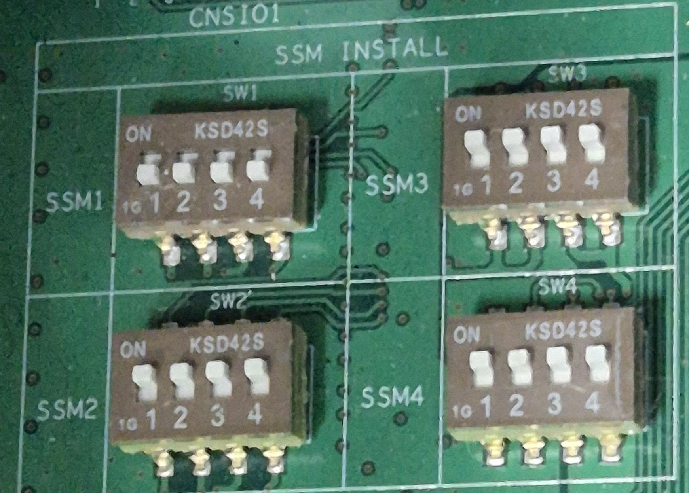

# 2. 준비작업

* 접속할 부품 및 자재들을 확인합니다.
* 미리 계산해 둔 데이터나 선정된 부가축 정보 등이 준비되었는지 확인합니다.
(감속비, AMP 사양, Motot 사양, 최고속, 가속시간 등)
* 축수에 따른 서보보드와 AMP의 조합은 다음과 같습니다.


 제어기 별 서보보드는 아래와 같습니다.
 (Hi6 : BD640, Hi7 : BD642)


  | 축 구성 | BD/AMP 구성 |
  | :------------------: | :-------------------: |
    | 1축 \~ 6축 (기본6축) | 서보보드 1개 6축 AMP 1개 |
  | 7축 \~ 8축 (기본6축 + 부가2축) | 서보보드 1개 6축 AMP 1개 1축 AMP 1~2개 |
  | 9축 ~ 12축 (기본6축 + 부가6축) | 서보보드 2개 6축 AMP 2개 |
  | 13축 ~ 16축 (기본6축 + 부가12축) | 서보보드 2개 6축 AMP 2개 1축 AMP 1~4개 |

 

* 축수에 따라서 인터페이스 보드(BD6H0)의 딥스위치 설정이 필요합니다. (※ Hi6 제어기만 해당)

  

  | 명칭 | 용도 | 설정방법|
  | :------------------: | :-------------------: | :-------------------: |
  | SW1 | SSM1(BD640 1번 보드) 연결 시, 설정하는 스위치 | SSM1 연결 시: 1/2/3/4 스위치 OFF   사용하지 않을 시: 1/2/3/4 스위치 ON |
  | SW2 | SSM1(BD640 2번 보드) 연결 시, 설정하는 스위치 | SSM2 연결 시: 1/2/3/4 스위치 OFF   사용하지 않을 시: 1/2/3/4 스위치 ON |
  | SW3 | SSM1(BD640 3번 보드) 연결 시, 설정하는 스위치 | SSM3 연결 시: 1/2/3/4 스위치 OFF   사용하지 않을 시: 1/2/3/4 스위치 ON |
  | SW4 | SSM1(BD640 4번 보드) 연결 시, 설정하는 스위치 | SSM4 연결 시: 1/2/3/4 스위치 OFF   사용하지 않을 시: 1/2/3/4 스위치 ON |

  

  
  <em>
그림 2.1 딥스위치 설정 예시 (SSM1 연결)
</em>


 서보보드 1 대당 8축 제어 가능, AMP 2종 (6축용, 1축용)

