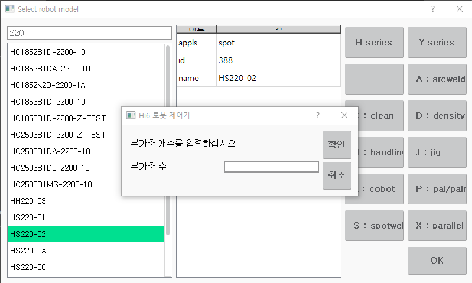
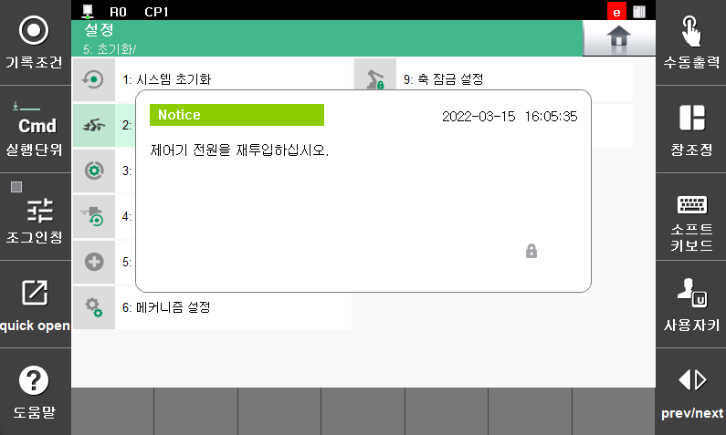
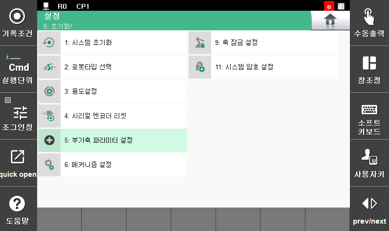

## 3.1 로봇타입 및 부가축수 설정

다음과 같은 순서로 부가축을 설정합니다.

(1) 수동모드의 『시스템』 → 『5: 초기화』 → 『2: 로봇타입선택』 메뉴에서 사용하고자 하는 로봇타입을 선택합니다.  

 </img>
 <em>
그림 3.1 로봇 타입 선택 화면
</em>

 


 로봇타입 및 부가축 정수를 설정하기 위해서는 엔지니어코드(R314)가 입력된 상태에서만 가능합니다. 모니터 화면 상단 우측의 “e” 표시가 엔지니어 코드가 입력된 상태임을 보여줍니다.  


 

(2) 부가축수를 입력하고 『확인』키를 눌러서 제어기를 재부팅합니다.

 </img>
 <em>
그림 3.2 제어기 재부팅 안내
</em>

 

(3) 『시스템』 → 『5: 초기화』 → 『[5: 부가축 파라미터 설정](../2-parameters/parameters.md)』 메뉴로 진입합니다. 

 </img>
 <em>
그림 3.3 부가축 파라미터 설정 메뉴
</em>

