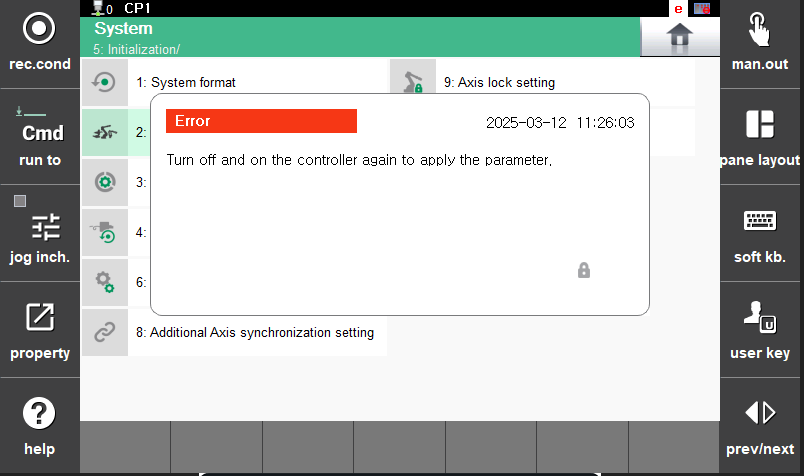

## 3.1 设置机器人类型和附加轴数量

附加轴的设置按以下顺序进行：

(1) 导航到 [System] → [5: Initialization] → [2: Robot type selection] 并选择机器人类型。


要配置机器人类型和附加轴参数设置，必须输入工程师代码 (R314)。显示器屏幕右上角的“e”指示灯确认工程师代码已输入。


(2) 输入附加轴的数量并按“OK”，然后重启控制器。

 </img>
 <em>
图 3.1 机器人类型选择界面
</em>

 
 

 </img>
 <em>
图 3.2 控制器重启通知
</em>

 

(3) 导航到 [System] → [5: Initialization] → [5: Additional axis parameter setting](../2-parameters/parameters.md)].

 </img>
 <em>
图 3.3 附加轴参数设置菜单
</em>

