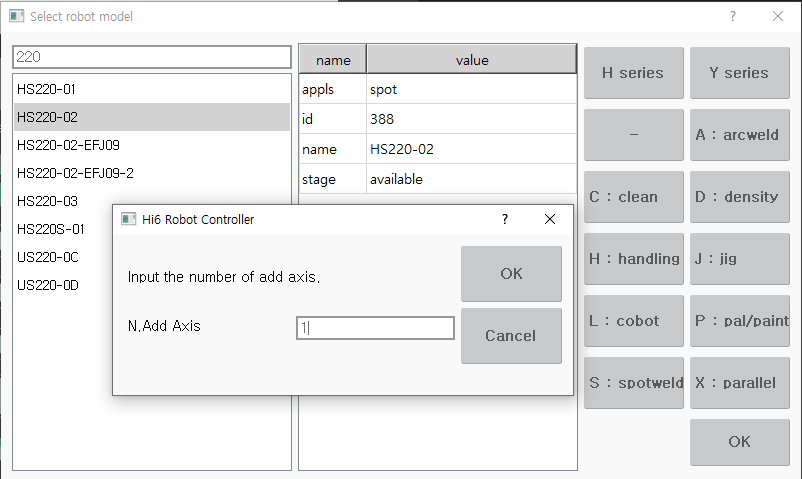
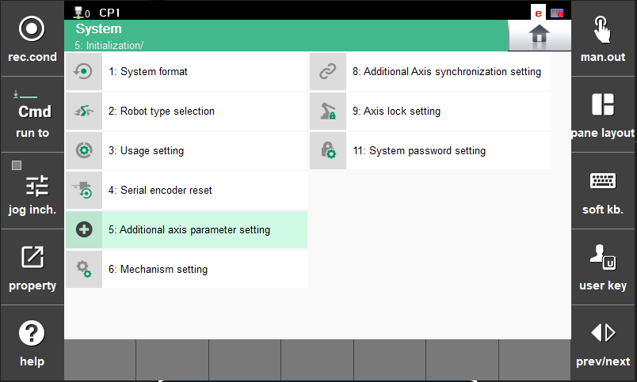

## 3.1 Setting up Robot Type and Number of Additional Axes

The additional axis is set up in the following order:

(1) Navigate to [System] → [5: Initialization] → [2: Robot type selection] and select the robot type.


To configure the robot type and additional axis parameter setting, the engineer code (R314) must be entered. The "e" indicator at the top right of the monitor screen confirms that the engineer code has been entered.


(2) Enter the number of additional axes and press "OK" and reboot the controller.

 </img>
 <em>
Figure 3.1 Robot Type Selection Screen
</em>

 
 

 </img>
 <em>
Figure 3.2 Controller Reboot Notification
</em>

 

(3) Navigate to [System] → [5: Initialization] → [5: Additional axis parameter setting](../2-parameters/parameters.md)].

 </img>
 <em>
Figure 3.3 Additional Axis Parameter Setting Menu
</em>

