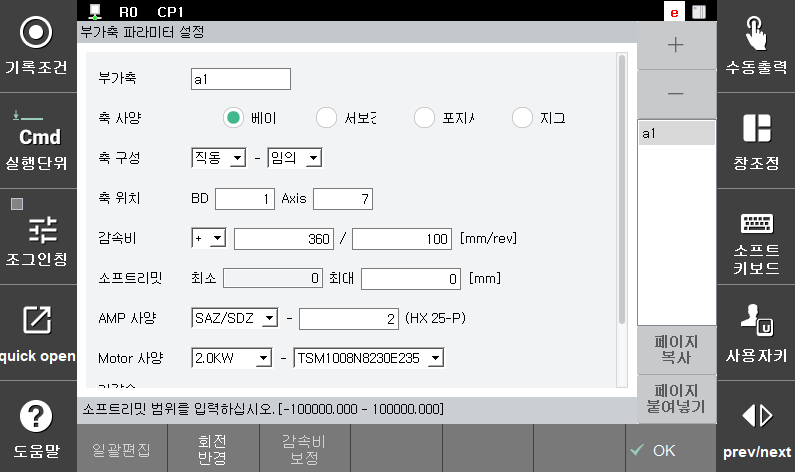
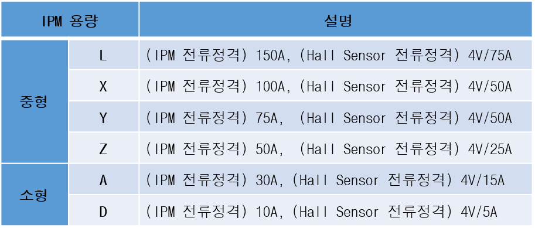
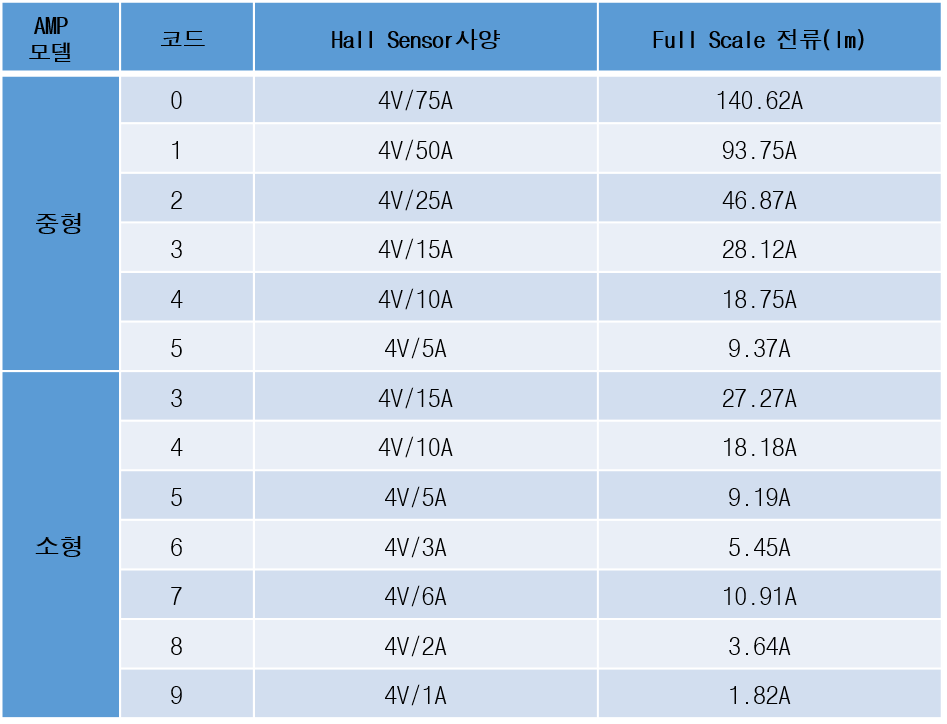

## 3.2 부가축 정수 설정

(1)	아래와 같은 『부가축 정수 설정』화면을 확인합니다.

 </img>
 <em>
그림 3.4 부가축 파라미터 설정
</em>

(2)	부가축 정수를 설정합니다.  
(3)	입력 종료는 『OK』키를 누릅니다. 

 

---

**【부가축 정수】**

(1)	축 사양 : 부가축 종류를 <베이스, 서보건, 포지셔너, 지그, 서보핸드> 중에서 선택합니다.  
부가축 사양을 결정할때는 논리적인 부가축 순서에 따라 베이스 → 서보건 → 포지셔너 → 지그 → 서보핸드 순을 지켜야합니다.  

(2)	축 구성 : 축의 동작형태와 방향을 선택합니다.  
직동 베이스축(주행축)인 경우는 전/후축 주행이면 <X>, 좌/우축 주행이면 <Y>로, 상/하축 주행이면 <Z>로 선택합니다. 베이스축이 로봇 좌표계와 동일한 방향으로 설치되지 않은 경우는 <임의>로 선택하고 『베이스축 캘리브레이션』을 실행합니다. 회전 베이스축도 직동 베이스축과 같이 Rx/Ry/Rz를 선택하거나 <임의>로 선택하여 『베이스축 캘리브레이션』을 실행합니다. 서보건을 설정하는 경우는 『[스폿용접 기능설명서](https://hrbook-hrc.web.app/#/view/doc-spot-weld/korean/2-servo-gun-initial-setting/README)』, 포지셔너를 사용하는 경우는 『[포지셔너동기 기능설명서](https://hrbook-hrc.web.app/#/view/doc-positioner-sync/korean/README)』를 참조하십시오.

(3)	축 위치 : 부가축의 물리적인 구성을 사용자가 지정하여 사용할수 있도록 합니다.

|축위치 정보 |설정값 |
|:---:|:---:|
| BD : '1'  | BD640보드 번호 : 1~2  |
| Axis : '7' | BD640 #1 : 7~8  BD640 #2 : 1~8  |

  ※ '1', '7' 로 설정하였다면, BD640 1번의 7번째 축으로 설정됨  

(4) 감속비 : 모터 회전수당 축의 이동량을 등록합니다.  
직동축은 모터 회전수당 축 이동거리를 mm로, 회전축은 모터 회전수당 축 회전각도를 deg로 등록합니다. 부호는 모터의 정방향(엔코더가 증가하는 방향)이 축 동작방향과 일치하여 부가축 좌표치가 증가하면 “+”이고, 반대로 좌표치가 감소한다면 “-“로 정합니다. 아래 예시를 참고하십시오.  

- 예 1) 1/100감속기만 사용하는 회전축이라면,  
모터 100회전에 축이 360deg회전하므로,  
감속비 = + 360 / 100 [deg/rev]  
- 예 2) 1/20감속기와 PCD 110mm인 랙피니언을 사용하는 직동축이라면,  
모터 20회전에 110xPhi(=3.14159)=345.5749[mm]를 이동하므로,  
감속비 = + 3455749 /200000 [mm/rev]  
- 예 3) 1/5 감속기와 Lead 5mm인 볼스크류를 사용하는 직동축이라면,  
모터 5회전에 축이 5mm이동하므로,  
감속비 = + 5 / 5 [mm/rev]  

(5)	소프트리밋 : 로봇 유효동작영역(부가축 소프트 리미트)을 설정합니다.
직동축은 [mm]로 회전축은 [deg]로 설정하면 『시스템』 → 『3: 로봇 파라미터』 → 『3: 소프트웨어 리미트』에 설정값이 반영됩니다.  

(6)	AMP 사양 : 부가축에 사용할 AMP의 사양을 선택합니다.  
IPM 기호를 선택하고 Hall Sensor 사양을 숫자 0-9 로 입력하여 AMP 사양을 선택합니다. AMP의 형식 사양은 다음과 같습니다.  

 </img>
 <em>
그림 3.5 IPM 사양
</em>

IPM 기호와 Hall Sensor 기호에 따라 아래의 정격 용량을 갖습니다.  

 </img>
 <em>
그림 3.6 Hall sensor 사양
</em>

(7)	Motor 사양 : 부가축에 사용되는 모터 사양을 선택합니다.  
모터의 용량을 먼저 선택하고, 모터 사양을 선택합니다.  
모터의 세부 속성값 중 일부에서 사소한 변경이 있는 경우, 동일한 모터 형번에 rev 번호가 추가되는 경우가 있습니다. 이 경우 rev 번호가 가장 높은 최신 모터정보를 선택 하시기를 권장 합니다.  
Ex> TSM3563N7020E731, TSM3563N7020E731_R1, TSM3563N7020E731_R2 중 TSM3563N7020E731_R2 모터를 선택 

(8)	가감속 파라미터 : 부가축의 최고속과 가속시간을 설정합니다.  
여기서 설정한 값은 『시스템』 → 『3: 로봇 파라미터』 → 『34: 가감속 파라미터』에 설정하는 것과 동일하게 적용됩니다. 부가축의 최고속을 사용자가 지정하지만, 모터 정격속도에 따라 제한됩니다. 부가축 동작중 진동이 발생하면 가속시간을 조정해야 합니다.  
