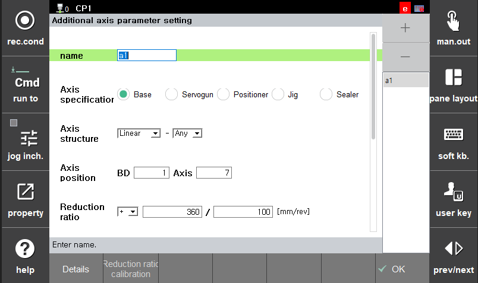

# 3.2 Additional Axis Parameter Setting

(1) Check the 『Additional axis parameter setting』 screen as shown below.

 </img>
 <em>
Figure 3.4 Additional Axis Parameter Setting
</em>

(2) Configure the additional axis parameter.
(3) Press 『OK』 to complete setting.

 

---

## **【Additional Axis Parameter】**

(1) Axis specification

* Select the type of additional axis form the following options:
Base, Servogun, Positioner, Jig, Sealer
* When determining the additional axis specification, follow the logical order:
Base → Servogun→ Positioner → Jig → Sealer

(2) Axis structure: Select the motion type and direction of the additional axis.

* For linear base axes(moving axes):
  * X-axis: Forward/Backward movement
  * Y-axis: Left/Right movement
  * Z-axis: Up/Down movement
* If the base axis is not installed in the same direction as the robot coordinate system, select "Any" and do "Base axis calibration".
* Like linear base axes, circular base axes can also be set to Rx/Ry/Rz or selected as "Any" and do "Base axis calibration".
* For "Jig" or "Sealer", the control mode can be selected as either "position control" or "speed control". In speed control mode, the motor rotates according to the motor speed command.
* For "Servogun", refer to the 『[Spot Welding Function Manual](https://hrbook-hrc.web.app/#/view/doc-spot-weld/english/2-servo-gun-initial-setting/README)』.
* For "Positioner", refer to the 『[Positioner Synchronization Function Manual](https://hrbook-hrc.web.app/#/view/doc-positioner-sync/english/README)』

(3) Axis position:

* Allows the user to axis configuration of the additional axis.

|Axis Position Information | Setting Value |
|:---:|:---:|
| BD : '1'  | BD640 board number: 1~2  |
| Axis : '7' | BD640 #1 : 7~8  BD640 #2 : 1~8  |

  ※ If set to '1', '7', the 7th axis on BD640 board #1 is selected.

(4) Reduction Ratio:

* Enter the movement amount of the additional axis per motor revolution.
* For linear axes, enter the movement amount of the additional axis per motor revolution in **mm**.
* For circular axes, enter the movement amount of the additional axis per motor revolution in **deg**.
* The **sign** is determined based on the positive direction of the motor(the direction in which the encoder value increases).
  * If the axis movement direction matches the increasing coordinate value of the additional axis, set it to "+".
  * If the coordinate value decreases instead, set it to "-".
* Refer to the example below for clarification.
* Example 1: If a circular axis uses only a 1/100 reduction gear.
  * Since the axis rotates 360 degrees for 100 motor revolutions,
    * The reduction ratio is:
      +360 / 100 [deg/rev]
* Example 2: If a linear axis uses a 1/20 reduction gear and a rack and pinion with a PCD of 110mm,
  * Since the axis moves $110\times \pi=345.5749 mm$ for 20 motor revolutions,
  * The reduction ratio is:
    +3455749 / 200000 [mm/rev]
* Example 3: If a linear axis uses a 1/5 reduction gear and a ball screw with a 5mm lead,
  * Since the axis moves 5mm for 5motor revolutions,
  * The reduction ratio is:
    +5 / 5 [mm/rev]

(5) Soft limit:

* Sets the effective operating range of additional axis
* For linear axes, set in millimeters [mm].
* For circular axes, set in degrees [deg].
* The values are applied in 『System』 → 『3:Robot parameter』 → 『3: Software limit』.

(6) AMP Specifications:

* Select the AMP specifications to be used for the additional axis.
* Choose the IPM symbol and enter the Hall Sensor specifications as a number between 0-9 to specify the AMP type. The AMP specification format is as follows:

  

  |IPM Capacity | Description |
  |:---:|:---:|
  |(medium) L  | (IPM current rating) 150A, (Hall Sensor current rating) 4V/75A |
  |(medium) X  | (IPM current rating) 100A, (Hall Sensor current rating) 4V/50A |
  |(medium) Y  | (IPM current rating) 750A, (Hall Sensor current rating) 4V/50A |
  |(medium) Z  | (IPM current rating) 50A, (Hall Sensor current rating) 4V/25A |
  |(small) A  | (IPM current rating) 30A, (Hall Sensor current rating) 4V/15A |
  |(small) D  | (IPM current rating) 10A, (Hall Sensor current rating) 4V/5A |

  

* The rated capacity is determined by the IPM symbol and hall Sensor symbol.

  

  |AMP Model | Code | Hall Sensor Specification| Full Scale Current (Im) |
  |:---:|:---:|:---:|:---:|
  |medium  | 0 | 4V/75A  |  140.62A|
  |medium  | 1 | 4V/50A  |  93.75A |
  |medium  | 2 | 4V/25A  |  46.87A |
  |medium  | 3 | 4V/15A  |  28.12A |
  |medium  | 4 | 4V/10A  |  18.75A |
  |medium  | 5 | 4V/5A   |  9.37A  |
  |small   | 3 | 4V/15A  |  27.27A |
  |small   | 4 | 4V/10A  |  18.18A |
  |small   | 5 | 4V/5A   |  9.19A  |
  |small   | 6 | 4V/3A   |  5.45A  |
  |small   | 7 | 4V/6A   |  10.91A |
  |small   | 8 | 4V/2A   |  3.64A  |
  |small   | 9 | 4V/1A   |  1.82A  |

(7) Motor Specifications:

* Select the motor specifications used for the additional axis.
* First, choose the motor capacity, then select the motor specification.
* If there are minor modifications to certain motor attributes, a revision number (rev) may be added to the motor model number. In such cases, it is recommended to select the latest motor version with the highest revision number.
  * Example:
    Among TSM3563N7020E731, TSM3563N7020E731_R1, and TSM3563N7020E731_R2, it is recommended to select TSM3563N7020E731_R2.

(8) Acceleration/Deceleration Parameters:

* Set the maximum speed and acceleration time for the additional axis.
* The values set here are applied in 『System』 → 『3: Robot parameter』 → 『34: Accel and decel parameter』.
* While the maximum speed of the additional axis can be specified by the user, it is limited by the motor's rated speed.
* If vibration occurs during additional axis operation, the acceleration time should be adjusted accordingly.
