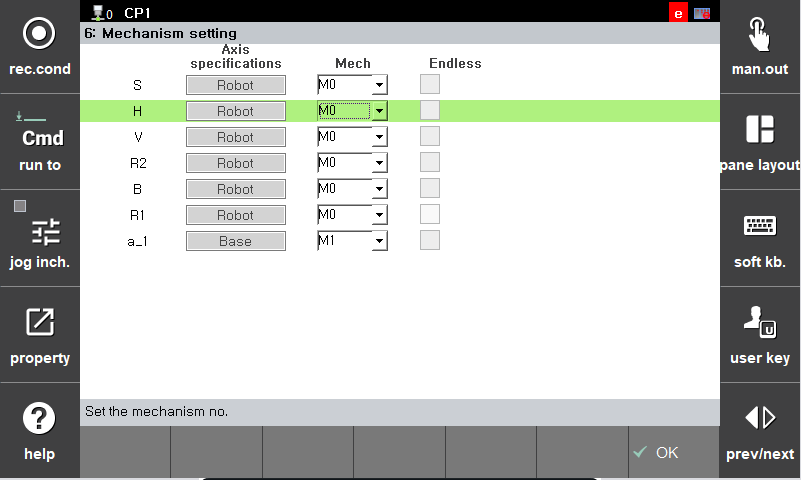
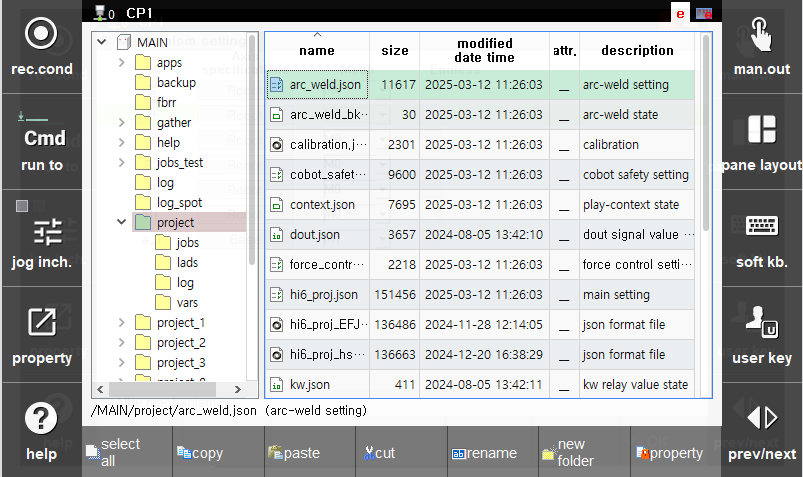

## 3.3 Mechanism Setting

(1) Mechanism setting

* Navigate to `[System] - 5: Initialization - 6: Mechanism Setting`.

 </img>
 <em>
Figure 3.7 Mechanism Setting
</em>

* The additional axis must have a mechanism group set in order to assign the jog key for manual mode. Robot axes are fixed to Mechanism M0. Additional axis can be classified from Mechanism M1 to M7.

 

(2) Parameter File Backup

* After completing the additional axis settings, copy the project file (hi6_proj.json) to a USB memory from `[Service] - 5: File manager`.

 </img>
 <em>
Figure 3.8 Setting File Backup
</em>

