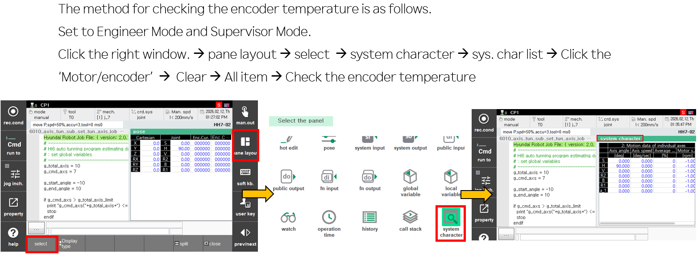
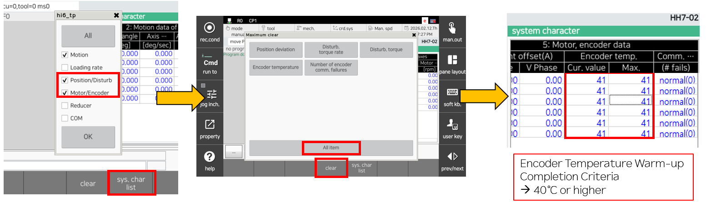
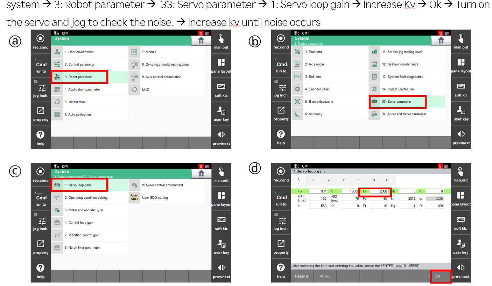
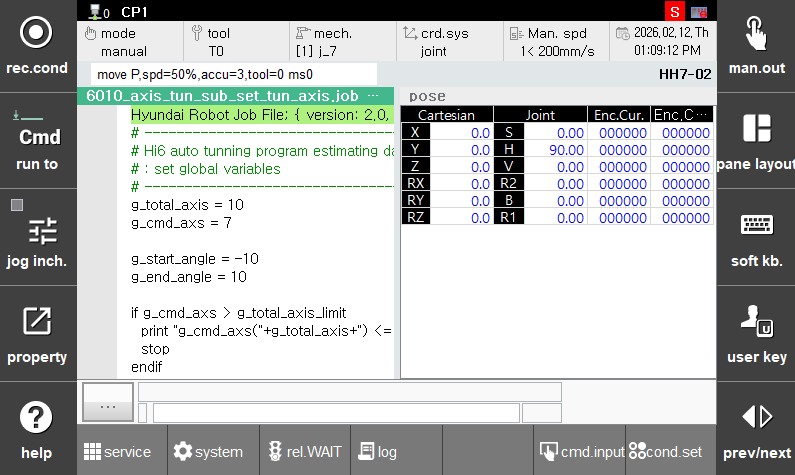
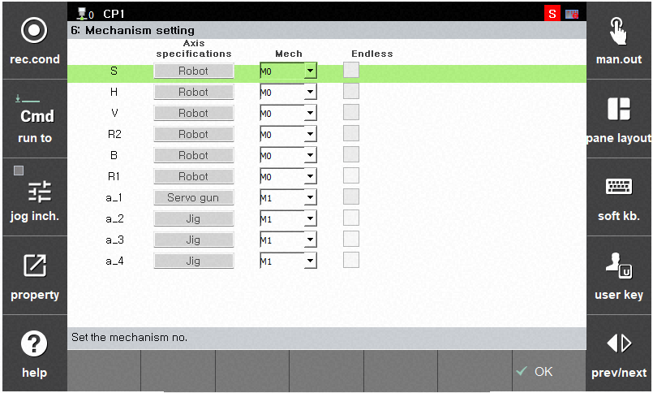
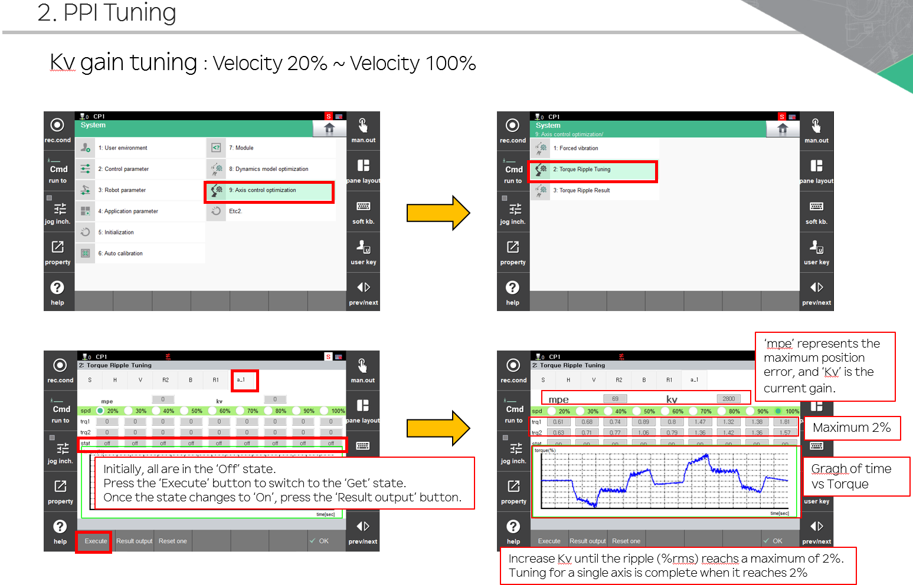
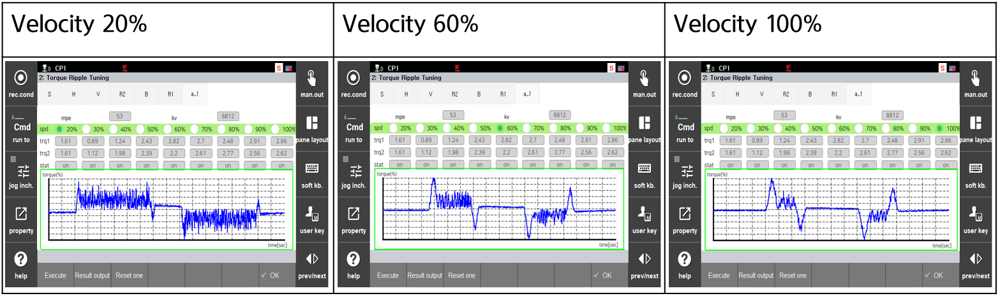

# 5. Manual Tuning of External Axes

This section describes the manual tuning of external axis servos.

### Specifications

(1) Tuning is available when the controller system is configured for up to 16 axes.
- In the case of a 6-axis robot, up to 10 external axes can be tuned.

(2) When in Engineering Mode (R314), the manual tuning function for external axes is activated in the UI. 

### Preparation
  
(1) Engineering Mode (R314)

(2) Job Files: The following files are required in the controller.

- 6000_axis_tun_sub_set_global_one_axis.job
- 6010_axis_tun_sub_set_tun_axis.job
- 6020_axis_tun_main_trq_ripple_mode1_one_axis.job
- 6040_axis_tun_sub_set_option_one_axis.job
- 6041_axis_tun_sub_set_pose_data_one_axis.job
- 6043_axis_tun_sub_run_high_spd_one_axis.job

(3) Warm Up the External Axis

The external axis should be warmed up to create an optimal tuning environment. The appropriate timing for tuning can be determined based on the encoder temperature. The checking method is as follows.

Figure 3.9 Checking encoder temperature during manual tuning of an external axis

Figure 3.10 Checking encoder temperature during manual tuning of an external axis

(4) Finding the Oscillation Gain

This is the process of finding the maximum gain value. The goal is to operate the robot using jog motion and identify the gain at which noise begins to occur.

Figure 3.11 Finding the oscillation gain during manual tuning of an external axis

Once the oscillation gain is found, reduce Kv by half and apply it. This value becomes the initial gain value.

### Tuning Procedure

(1) 6010.job Program (Setup Job File)

* g_total_axis = Total number of axes configured in the controller
* g_cmd_axis = External axis number to be tuned
* g_start_angle = Start position for external axis tuning (Rotational axis: deg, Linear axis: mm)
* g_end_angle = End position for external axis tuning (Rotational axis: deg, Linear axis: mm)

#### Example

Figure 3.12 6010.job screen

Figure 3.13 External axis mechanism screen

The total number of axes configured in the controller is 10 (6 robot axes + 4 external axes): g_total_axis = 10

To tune External Axis 2 (a_2, jig): g_cmd_axis = 8 (6 robot axes + External Axis 2)

Start/End position of External Axis 2 (a_2, jig): g_start_angle/g_end_angle should be set according to the soft limits and travel range. Here, it is configured to operate from -10 deg to 10 deg as an example.

* Note: If the travel range is too short, torque ripple values may not be output at high speed.

(2) Running 6020.job (Main job file for actual tuning)

6020.job must be executed after setting the total number of axes (g_total_axis), the axis to be tuned (g_cmd_axis), and the motion range (g_start_angle/g_end_angle) in 6010.job.

Run in 1Cycle mode at 100% playback speed.

When 6020.job is executed, it first checks the motion range at low speed.

After confirming the motion range, the program will stop due to a stop command within 6020.job. If there is no issue with the motion range, press Start to continue.
  

(3) Checking Results (Screen: System → Axis Control Optimization → Torque Ripple Tuning)

Figure 3.14 Torque Ripple screen configuration

Note1. At lower speeds, the get holding time may take longer.

Note2. If the state is ON on the screen, press the 'Single Initialization' button to turn it OFF, then press the 'Execute' button.

 

The results can be checked as follows.

Figure 3.15 Result confirmation

(4) Tuning Completion Criteria

Torque ripple must not exceed 2% at any speed.
Position deviation should be maintained around 100 or less.
Noise and vibration must not occur.
Increase Kv repeatedly until the torque ripple approaches 2%.
Find the optimal Kv value that satisfies all of the above conditions simultaneously. 

 

(Reference) If noise or vibration occurs even when the torque ripple is below 2%, reduce Kv until noise and vibration no longer occur.
