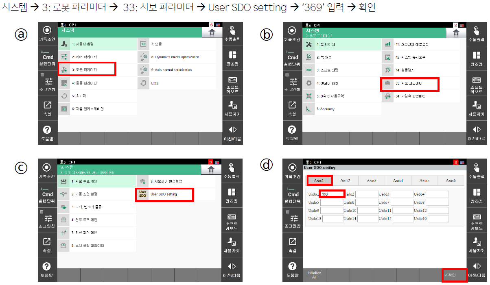
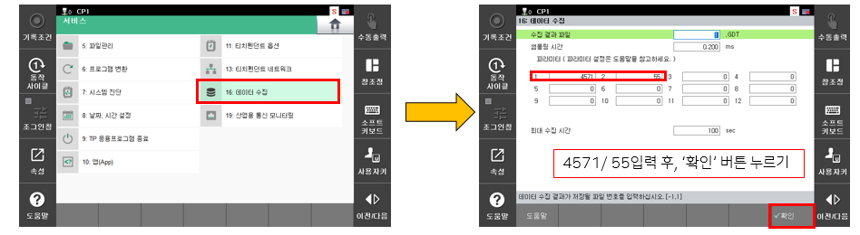

# 5. 부가축 수동 튜닝
부가축 서보의 수동 튜닝에 대하여 설명합니다. 
  
  
 

**【 사전 준비 】**
  
>(1) 엔지니어 모드(R314)  
>(2) USER SDO 설정

 </img>
 <em>
그림 3.9 부가축 수동 튜닝 사전 설정(USER SDO)
</em>

>(3) 부가축 예열하기
부가축을 예열하여, 최적의 튜닝 환경 구성을 하기 위함입니다. 엔코더 온도를 기준으로 튜닝 시기를 판별할 수 있고, 확인 방법은 다음과 같습니다.

 </img>
 <em>
그림 3.10 부가축 수동 튜닝 시, 엔코더 온도 확인
</em>

 </img>
 <em>
그림 3.11 부가축 수동 튜닝 시, 엔코더 온도 확인
</em>

>(4) 발진 게인 찾기  
게인의 최대값을 찾는 작업입니다.

 </img>
 <em>
그림 3.12 부가축 수동 튜닝 시, 발진 게인 찾기
</em>

발진 게인을 찾았다면, Kv를 절반으로 감소하여 적용합니다. 이 값이 초기 게인 값입니다.

>(5) 위치 편차 확인  
'부가축 예열하기'과 동일합니다. 여기서 '위치 편차' 항목에 대해서 확인하면 됩니다. 

>(6) 데이터 게더링 설정  
토크 리플에 대한 정보를 가져오기 위함입니다.

 </img>
 <em>
그림 3.13 부가축 수동 튜닝 시, 데이터 수집 설정
</em>

**【 튜닝 진행 】**
JOB 파일에 gather 1 ~ gather 0이 포함되어 있어야하며, ~ 사이에는 구동 자세를 넣으면 됩니다.  
자세는 소프트리밋이 안걸릴만큼 구동합니다. 구동하면, 게더링 파일이 생성될 것이며, 생성된 게더링 파일의 마지막 행이 토크리플 값입니다. 
참고로 이 값이 모든 속도 구간에서 2를 초과해선 안됩니다. 동시에 위치편차도 100미만으로 들어올 수 있도록 하여 최적의 Kv 값을 찾으면 됩니다. 
이를 속도 10%부터 100%까지 10%씩 올려가며 구동하시고, 위의 조건을 만족하는 Kv를 찾으면 됩니다.   

