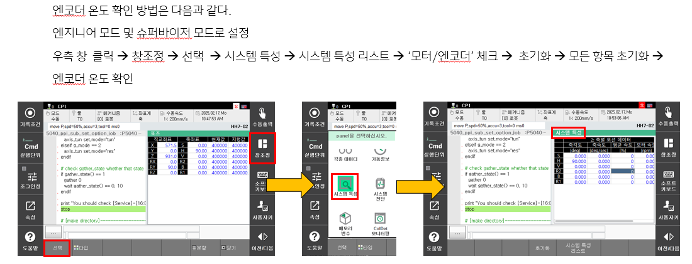
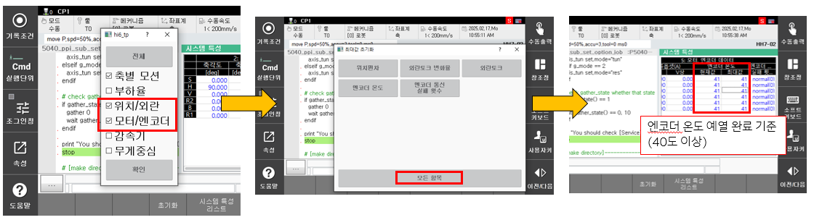
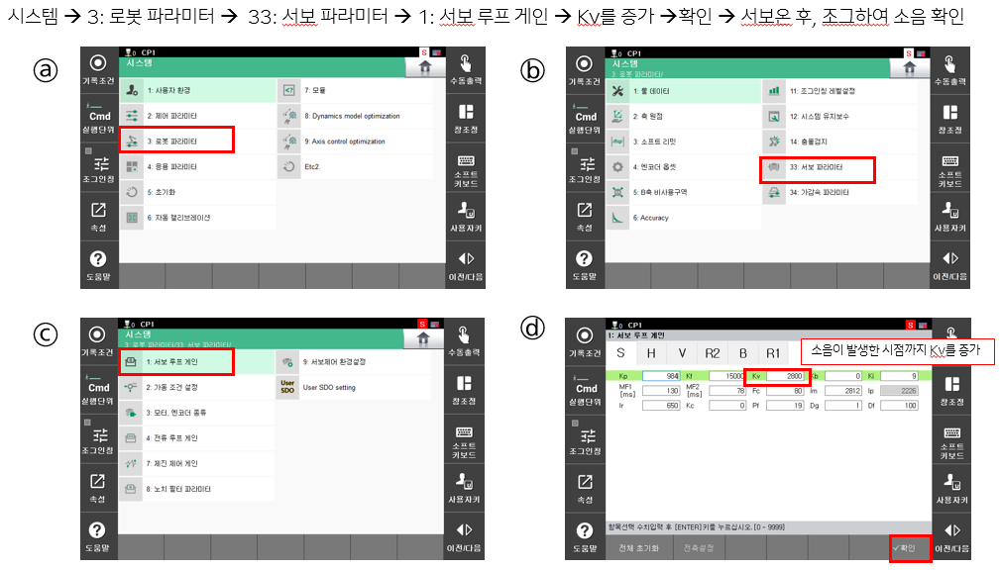
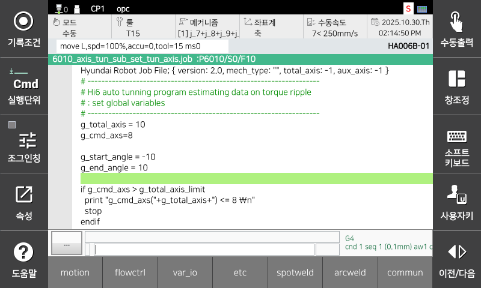
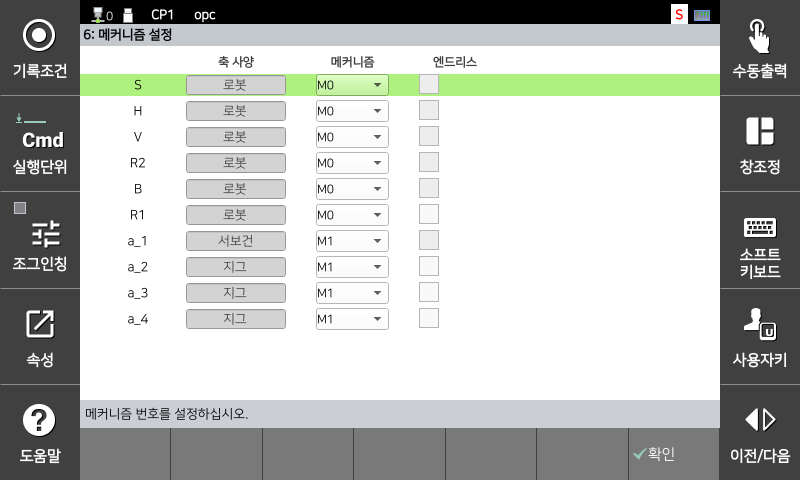
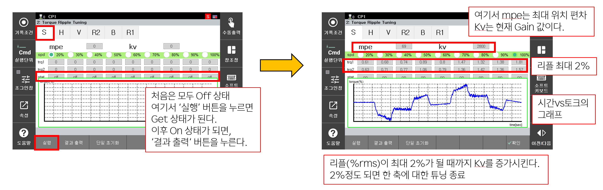
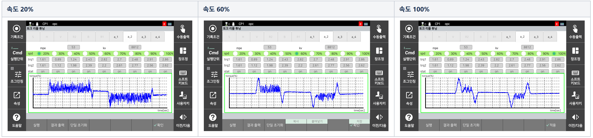

# 5. 부가축 수동 튜닝
부가축 서보의 수동 튜닝에 대하여 설명합니다. 

 

**[ 사양 ]**  

>(1) 제어기 시스템이 최대 16축 까지 설정된 상황에서 튜닝 가능합니다. 
- 6축 로봇인 경우, 부가축은 10축 까지 튜닝 가능합니다. 
>(2) R314 엔지니어링 모드인 경우, UI상에서 부가축 수동 튜닝 기능이 활성화됩니다. 

 

**[ 튜닝 파라미터 의미 ]**  

>(1) Kv : 가상 점성 계수. 
- 증가 시: 진동 및 속도 편차가 감소하여 안정성이 향상됨. 단, 과도하게 증가할 경우 토크 리플 및 소음이 증가할 수 있음.
- 감소 시: 토크 리플 및 소음은 감소할 수 있으나, 진동 및 속도 편차가 증가하여 제어 성능이 저하될 수 있음.

 

**[ 사전 준비 ]**
  
>(1) 엔지니어 모드(R314)  
>(2) 잡파일: 제어기에 다음의 파일들이 필요합니다.
- 6000_axis_tun_sub_set_global_one_axis.job
- 6010_axis_tun_sub_set_tun_axis.job
- 6020_axis_tun_main_trq_ripple_mode1_one_axis.job
- 6040_axis_tun_sub_set_option_one_axis.job
- 6041_axis_tun_sub_set_pose_data_one_axis.job
- 6043_axis_tun_sub_run_high_spd_one_axis.job

>(3) 부가축 예열하기
부가축을 예열하여, 최적의 튜닝 환경 구성을 하기 위함입니다. 엔코더 온도를 기준으로 튜닝 시기를 판별할 수 있고, 확인 방법은 다음과 같습니다.

 </img>
 <em>
그림 3.9 부가축 수동 튜닝 시, 엔코더 온도 확인
</em>

 </img>
 <em>
그림 3.10 부가축 수동 튜닝 시, 엔코더 온도 확인
</em>

>(4) 발진 게인 찾기  
게인의 최대값을 찾는 작업입니다. 조그를 통해 로봇을 구동해보고 소음이 발생하기 시작한 게인을 찾는 것이 목표입니다.

 </img>
 <em>
그림 3.11 부가축 수동 튜닝 시, 발진 게인 찾기
</em>

발진 게인을 찾았다면, Kv를 절반으로 감소하여 적용합니다. 이 값이 초기 게인 값입니다.
  
  

**[ 튜닝 진행 ]**
>(1) 6010.job 프로그램(설정 잡파일)
- g_total_axis = 제어기에 설정된 총 축 갯수
- g_cmd_axis = 튜닝 부가 축 번호
- g_start_angle = 부가축 튜닝 시작 위치 (회전 축 : deg, 직선 축 : mm)
- g_end_angle = 부가축 튜닝 종료 위치 (회전 축 : deg, 직선 축 : mm)
  
- 예시

 </img>
 <em>
그림 3.12 6010.job 화면
</em>

 </img>
 <em>
그림 3.13 부가축 메커니즘 화면
</em>

  
제어기에 설정된 총 축 수는 10축(로봇 6축 + 부가 4축) : g_total_axis = 10  
부가 2축(a_2, 지그)을 튜닝 하기 위해 : g_cmd_axs = 8 (로봇 6축 + 부가 2축) 
부가 2축(a_2, 지그)의 시작/종료 위치 : g_start_angle/g_end_angle = 소프트리밋과 이동 반경에 맞게 설정합니다. 여기는 -10Deg에서 10Deg로 구동하도록 설정하는 예시입니다. 
* 참고: 구동 범위가 너무 짧은 경우, 고속에서 토크리플 값이 출력되지 않을 수 있습니다.  
  

>(2) 6020.job 구동(실제 튜닝을 진행하는 메인 잡파일)
- 6010.job에서 총 축 수(g_total_axis) 및 해당 튜닝 축 번호(g_cmd_axs)와 이동 반경(g_start_angle/g_end_angle)을 이미 설정한 상태에서 6020.job 파일을 실행해야 합니다.
- 1Cycle, 재생속도 100%로 실행바랍니다.
- 6020.job을 실행하면, 저속으로 동작범위를 확인합니다.
- 동작범위 확인 이후 6020.job 중간에 stop구문이 있어 정지할 것입니다. 구동 범위에 이상 없으시면, Start하시면 됩니다. 
  

>(3) 결과 확인(화면: 시스템 -> 축 제어 최적화 -> 토크리플 튜닝)

 </img>
 <em>
그림 3.14 토크 리플 화면 구성
</em>

- 참고1. 저속일 수록, get 유지 시간이 더 소요될 수 있습니다.
- 참고2. 화면에서 state가 on 상태인 경우, '단일 초기화' 버튼을 누르고 off 상태로 만든 뒤, '실행'버튼을 누르세요.
 
다음과 같이 결과를 확인할 수 있습니다.

 </img>
 <em>
그림 3.15 결과 확인
</em>

>(4) 튜닝 완료 조건
- 토크리플이 모든 속도에서 2%를 초과해선 안됩니다.
- 위치편차도 100 내외로 들어올 수 있도록 합니다. 
- 소음 및 진동이 발생하지 않아야 합니다.
- 토크리플이 2% 근처까지 도달할 때까지 반복하여 Kv를 증가시키면 됩니다. 
- 위의 경우를 동시에 충족할수 있도록 최적의 Kv 값을 찾으시면 됩니다.  
  
(참고) 만약 토크리플이 2% 미만일지라도, 소음 및 진동이 발생하는 경우, 소음 및 진동이 발생하지 않도록 Kv를 감소시키시면 됩니다. 
